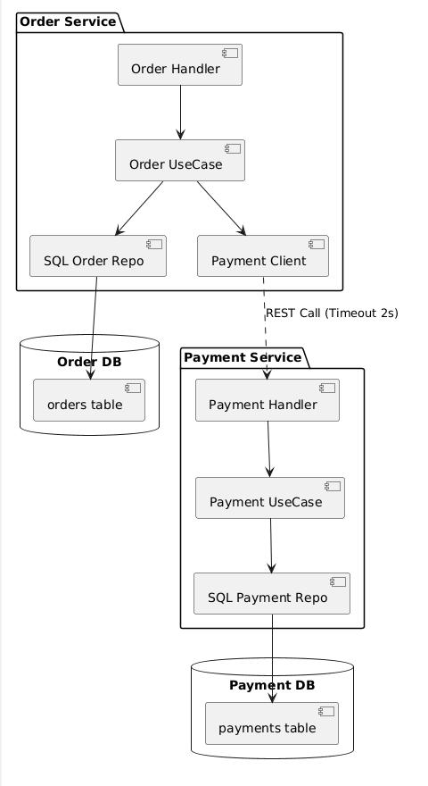

# AP2 Assignment 1: Order & Payment Microservices
**Author:** Diasbek Amangeldiev  
**Deadline:** 01.04.2026 23:59

## Architecture Overview
This project implements two microservices following **Clean Architecture** principles (Domain, UseCase, Repository, and Transport layers). 

### Bounded Contexts
1. **Order Context**: Responsible for managing the order lifecycle (Pending, Paid, Failed, Cancelled).
2. **Payment Context**: Responsible for transaction processing and limit enforcement ($1000/100,000 cents).

### Communication
The services communicate synchronously over **REST**. The Order Service acts as a client to the Payment Service.

## Failure Handling & Resilience
- [cite_start]**Timeout**: The Order Service uses a custom `http.Client` with a **2-second timeout**[cite: 101].
- [cite_start]**Availability**: If the Payment Service is down, the Order Service returns a `503 Service Unavailable`[cite: 105].
- **State Consistency**: Orders are initially saved as `Pending`. [cite_start]If a payment call fails or times out, the order is marked as `Failed` to ensure the user knows the transaction did not complete[cite: 106].

## Database Setup
- Each service has its own dedicated database schema.
- SQL migrations are located in the `/migrations` folder of each service.
- **Order DB**: Stores order details.
- **Payment DB**: Stores transaction records.

## How to Run
1. Run PostgreSQL locally on port 5432.
2. Create `order_db` and `payment_db`.
3. Run migrations provided in each service.
4. `go run cmd/order-service/main.go`
5. `go run cmd/payment-service/main.go`

## Architecture Diagram

graph TD
    %% Настройки цветов и стилей для красоты
    classDef client fill:#E1F5FE,stroke:#0288D1,stroke-width:2px,color:#000
    classDef service fill:#E8F5E9,stroke:#388E3C,stroke-width:2px,color:#000
    classDef db fill:#FFF3E0,stroke:#F57C00,stroke-width:2px,color:#000
    classDef grpc fill:#F3E5F5,stroke:#7B1FA2,stroke-width:2px,color:#000

    %% Компоненты системы
    User((Thunder Client REST Клиент)):::client
    OrderDB[(PostgreSQL order_db)]:::db
    
    subgraph "Order Microservice"
        OrderREST[Order REST API Port: 8080]:::service
        OrderGRPC[Order gRPC Stream Port: 50052]:::grpc
    end
    
    PaymentService[Payment Service gRPC Port: 50051]:::grpc
    StreamClient((Go Client Script Слушатель статусов)):::client

    %% Связи и стрелки
    User -- "1. POST /orders\n(HTTP JSON)" --> OrderREST
    OrderREST -- "2. Create / Update\n(SQL)" --> OrderDB
    OrderREST -- "3. ProcessPayment\n(gRPC Unary)" --> PaymentService
    
    StreamClient -- "4. SubscribeToOrderUpdates\n(gRPC Server-Side Stream)" --> OrderGRPC
    OrderGRPC -. "5. Читает изменения\nстатусов" .-> OrderDB